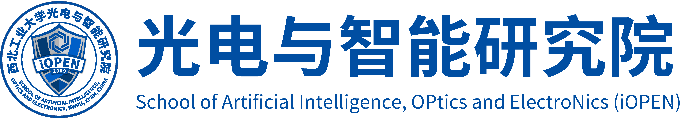

# iOPENText Group
The Northwestern Polytechnical University iOPENText Group focuses on text detection, recognition, and spotting simultaneously. This project provides kinds of resources to help junior researchers follow this field's development.

## Group members

Chuang. Yang (Ph.D. candidate); [Homepage](https://github.com/omtcyang)

Xu. Han (Ph.D. candidate); [Homepage](https://github.com/a885041573)

Yuhu. Guo (Master candidate); [Homepage](https://github.com/wanfeng132)

Changxing. Guo (Master candidate); [Homepage](https://github.com/guocx1g)

Haozhao. Ma (Master student); [Homepage](https://github.com/hfut-mhz)

## License

This project is developed and maintained by [the School of Computer Science, and the School of Artificial Intelligence, OPtics and Electronics (iOPEN), Northwestern
Polytechnical University](http://iopen.nwpu.edu.cn/).

